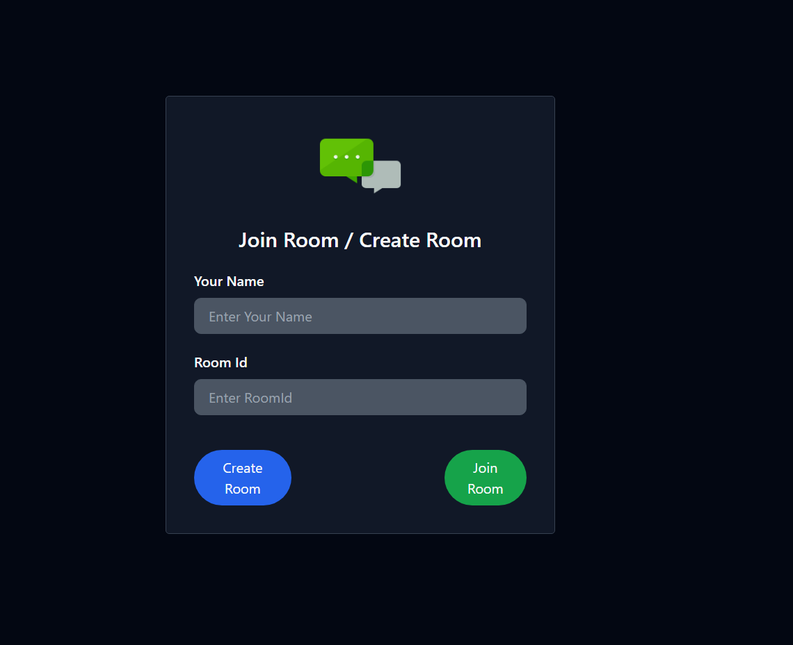
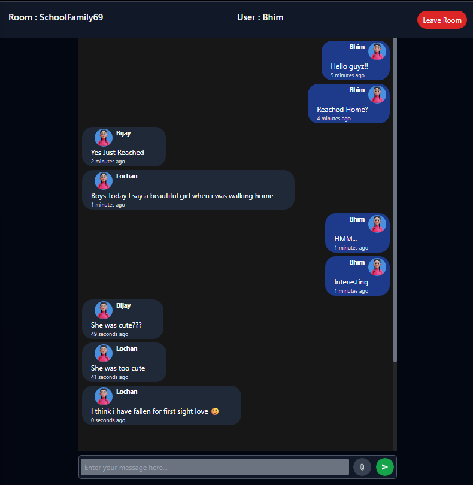
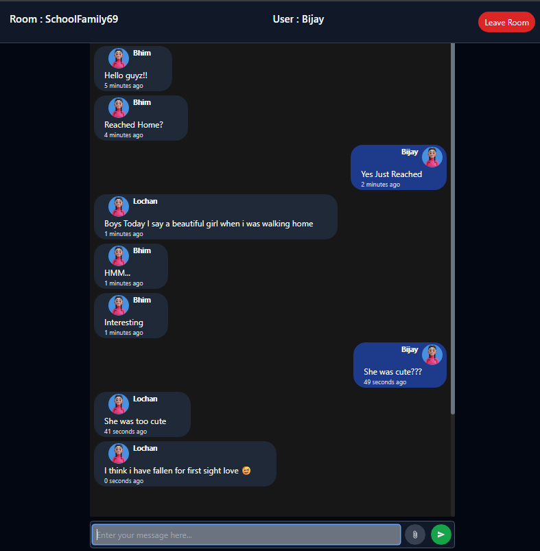
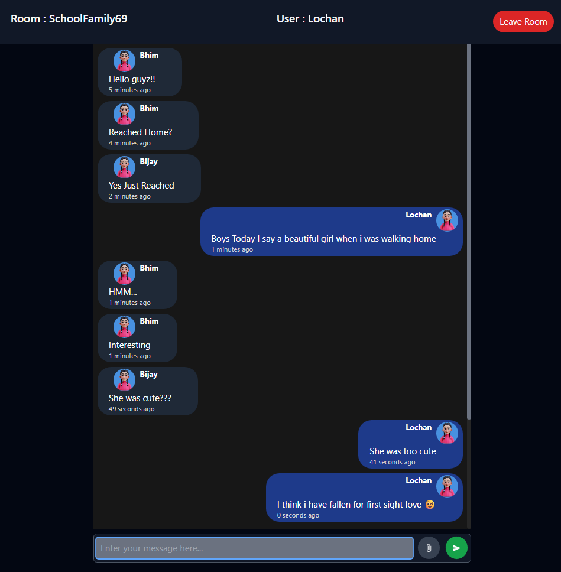

# Realtime Chat App

A simple real-time chat application built with React and Spring Boot using WebSockets.

## Features

- Join chat rooms with a username
- Send and receive messages instantly
- Leave chat room functionality
- Press Enter to send messages

## Screenshots

**Joining Page**
<br />


**Chat Room (Multiple Users)**
<br />




## Tech Stack

- Frontend: React, Tailwind CSS
- Backend: Spring Boot, WebSocket (STOMP over SockJS)

## Getting Started

```bash
# Install frontend dependencies
npm install

# Start the frontend
npm run dev
